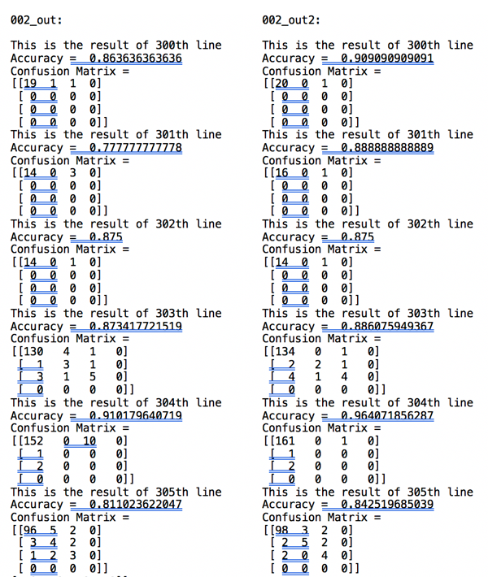

# Capio_challenge

This is the repository for the coding challenge from Capio.
In this challenge, I implemented three main command-line-interface python files for task1-4 and optional task. 
- run_formatter.py      This is for task 1 and 2.
- evaluate_Formatter.py        This is for task 3 and 4.
- run_formatter_opt_task.py       This is for optional task.

# Dependencies

I used the following packages:

- re
- numpy
- sklearn
- sys
- requests
- json

Please make sure you have them installed before you run the code.

# How to run the codes

First of all, please make sure you have 'dataset' directory under the root directory. Then you can issue your command based on your file path and filename in the 'dataset' directory.
For example, if your 'dataset' direcrtory has subfolder called 'formatted' and 'unformatted'. Then, 

For task 1 and 2, you can type this in your command window:

``python run_formatter.py --input-file ./dataset/unformatted/001.txt --output-file ./dataset/unformatted/001_out.txt``

Then after a while for API calling, you will get a .txt file named '001_out.txt' in the directory '/dataset/unformatted/'.

For task 3 and 4, you can type this in your command window:

``python evaluate_Formatter.py --output-file ./dataset/unformatted/001_out.txt --reference-file ./dataset/formatted/001.txt``

Then you will get the evaluation results(Confusion Matrix and Accuracy) for the '001_out.txt' based on its formatted file '001.txt'.

For the optional task, you can type this in command window:

``python run_formatter_opt_task.py --input-file ./dataset/unformatted/001.txt --output-file ./dataset/unformatted/001_out5678.txt --api-endpoint  http://34.212.39.136:5678/format``

Then you will get similar result as in task 1 and 2.

# Result of the optional task

In this task I compared the Accuracies given by two models, using some text from the fromatted '002.txt' and the model output to unformatted '002.txt'. 
The result is as follow, in which '002_out' is genereated by http://34.212.39.136:5679/format, and '002_out2' is generated by  http://34.212.39.136:5678/format. We can see that the second model gives higher accuracy. 

# Some additional notes

- My implementations of calling API and evaluation are both developed in a line-by-line manner. 
- For a given Confusion Matrix, you can get other metrics like True Positive Rates, False Positive Rates, F1-scores, etc for each class. But due to time limitation and since here we can already see the overall performance difference of the two models by their Accuracy, I did not calculate and compare those metrics. Calculating those metrics may generate some more in-depth comparisons for each class, other than the overall performance. 
